# AI Teacher Assistant - Phase 1 Sequence Diagram

# 1. Global Application Flow

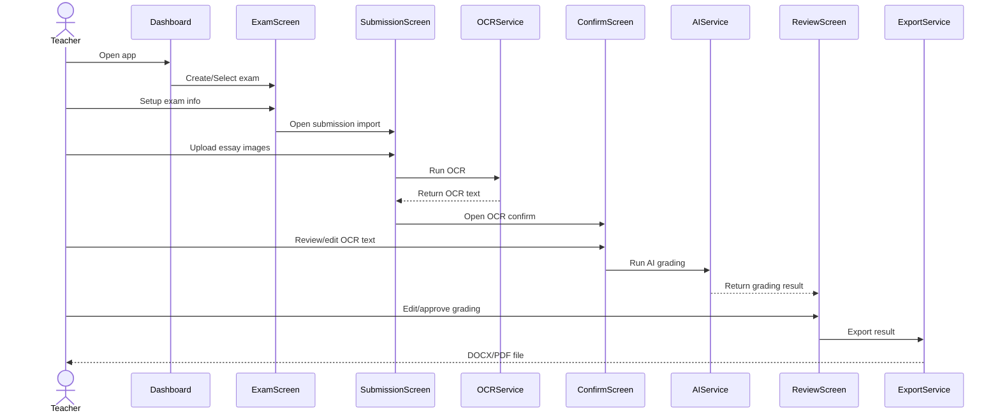

---

# 2. Dashboard Screen Flow

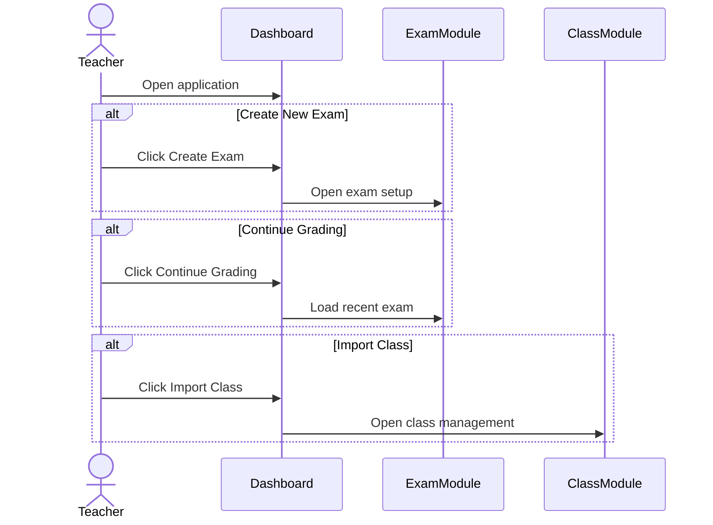

---

# 3. Class Management Flow

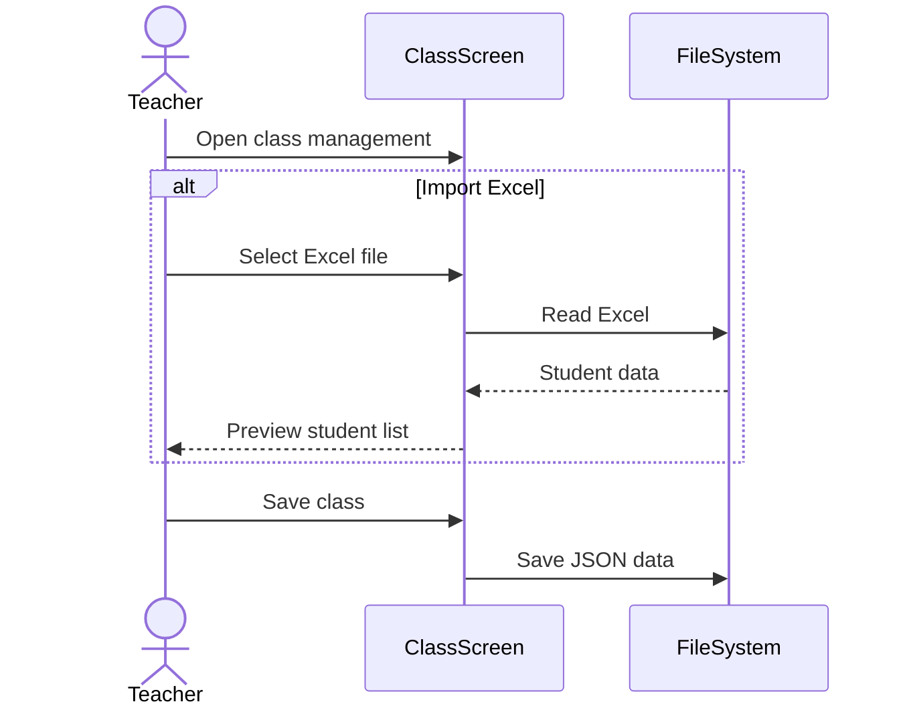

---

# 4. Student Detail Flow

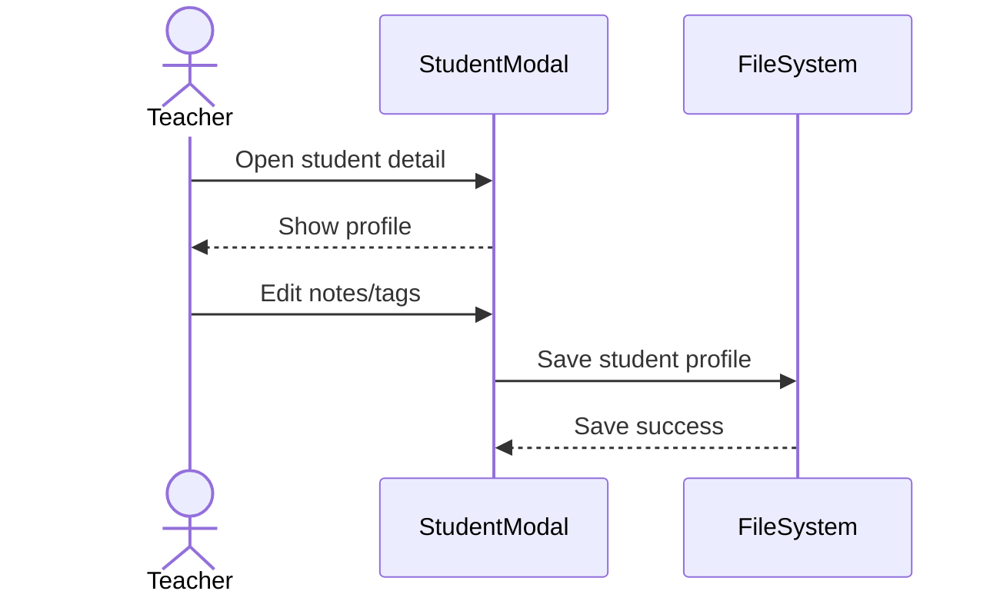

---

# 5. Create Exam Flow

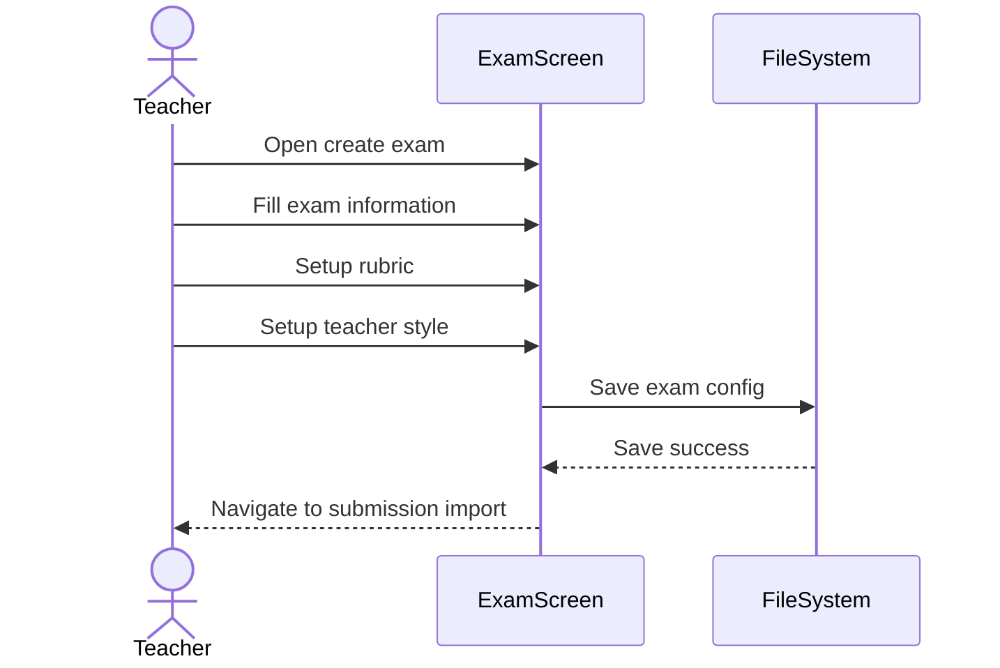

---

# 6. Submission Import Flow

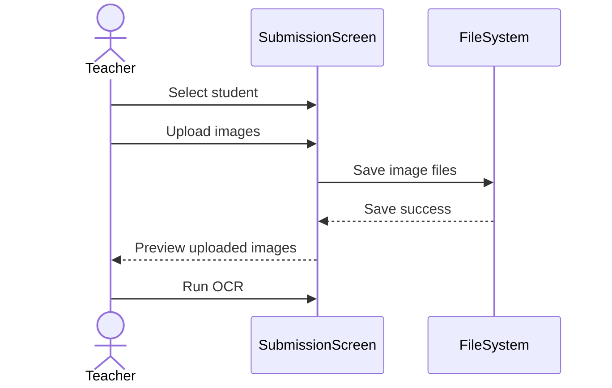

---

# 7. OCR Processing Flow

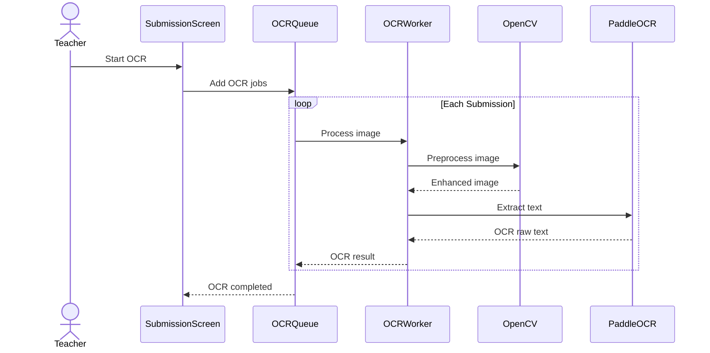

---

# 8. OCR Confirm Screen Flow

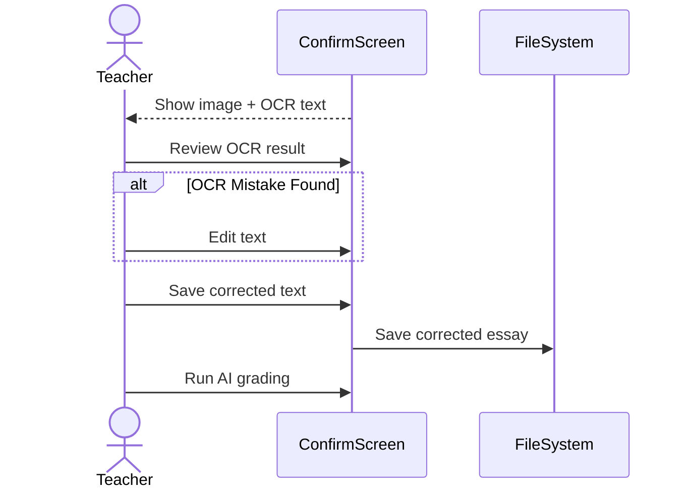

---

# 9. AI Grading Flow

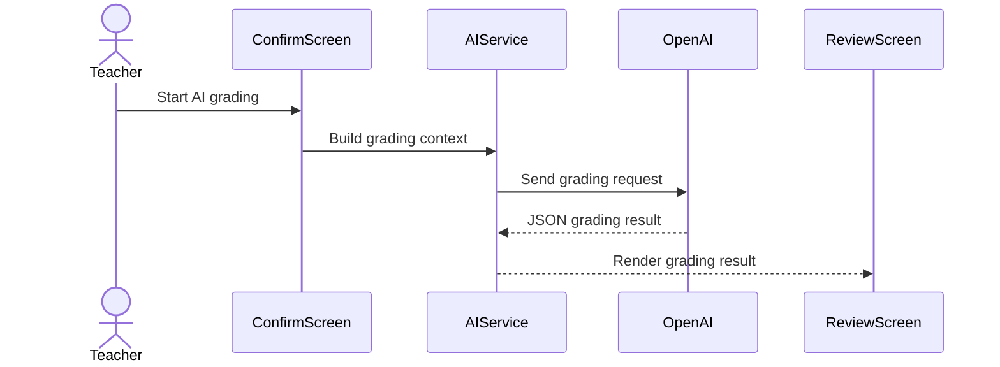

---

# 10. AI Inline Annotation Flow

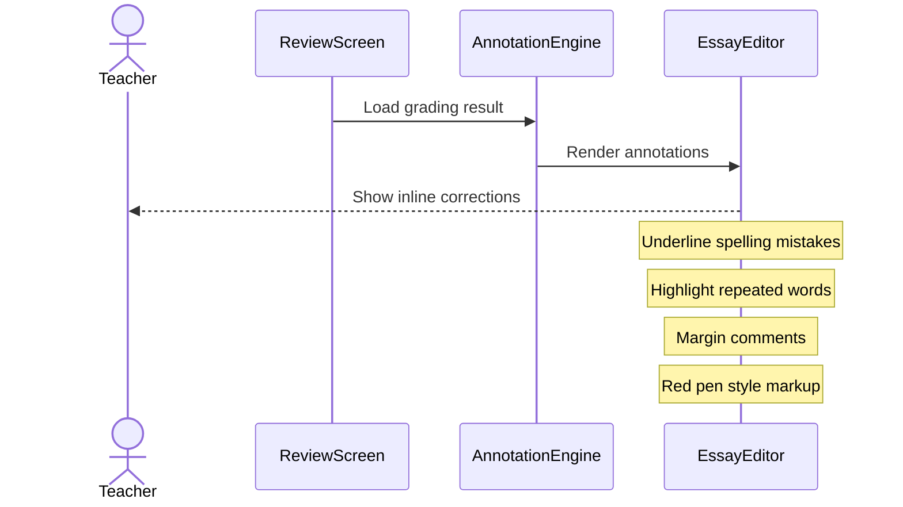

---

# 11. Teacher Review Flow

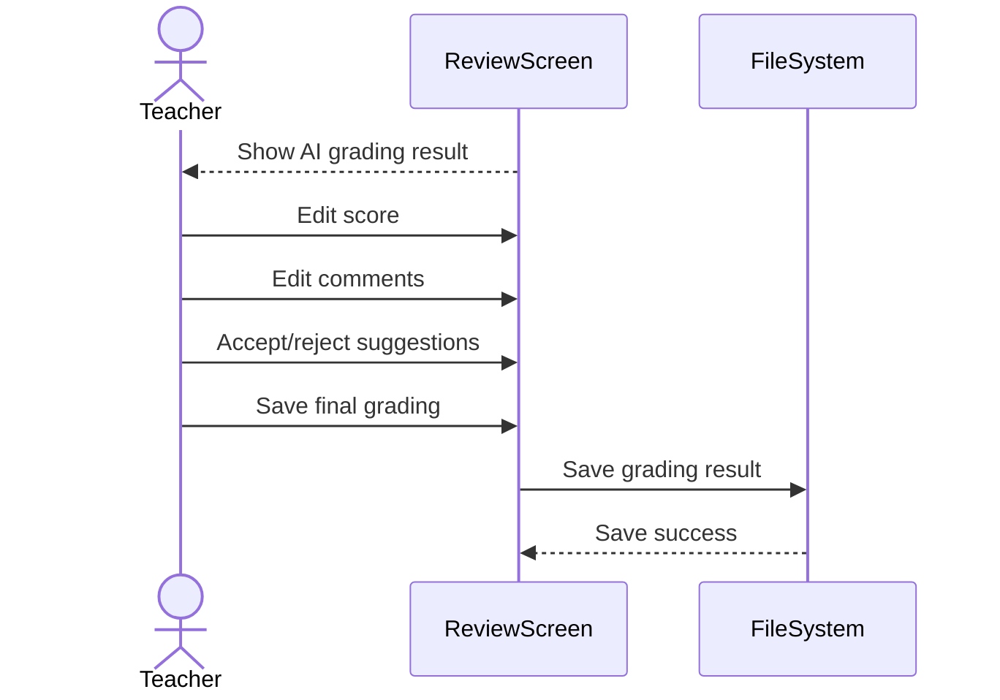

---

# 12. Export Result Flow

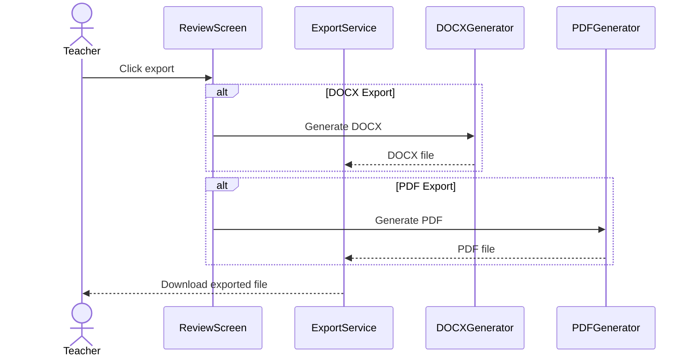

---

# 13. Settings Flow

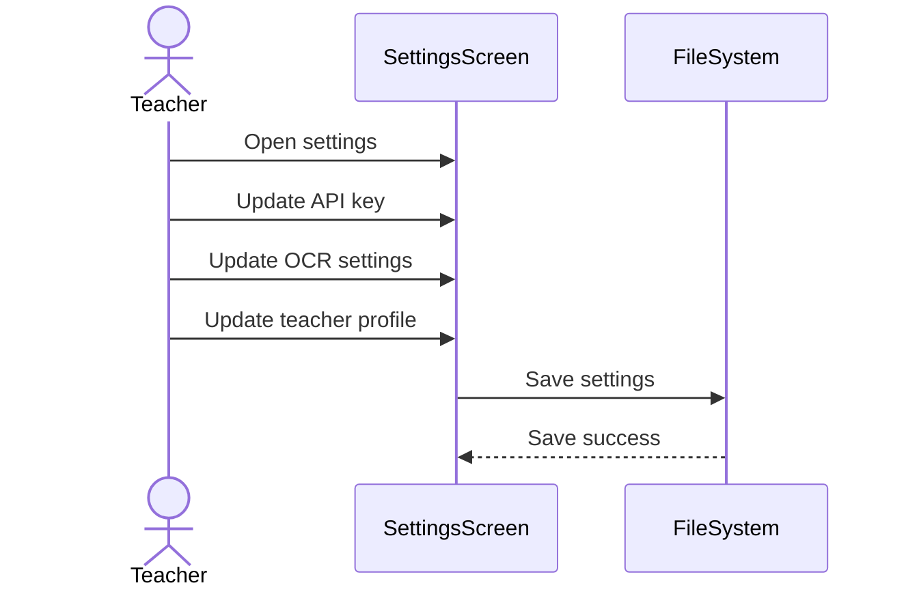

---

# 14. Local Storage Flow

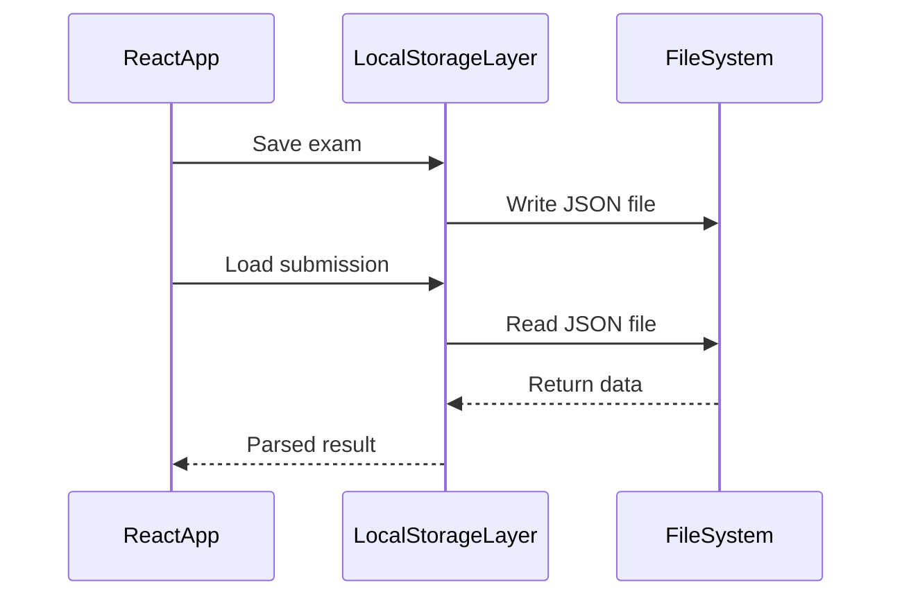

---

# 15. Full Essay Grading Lifecycle

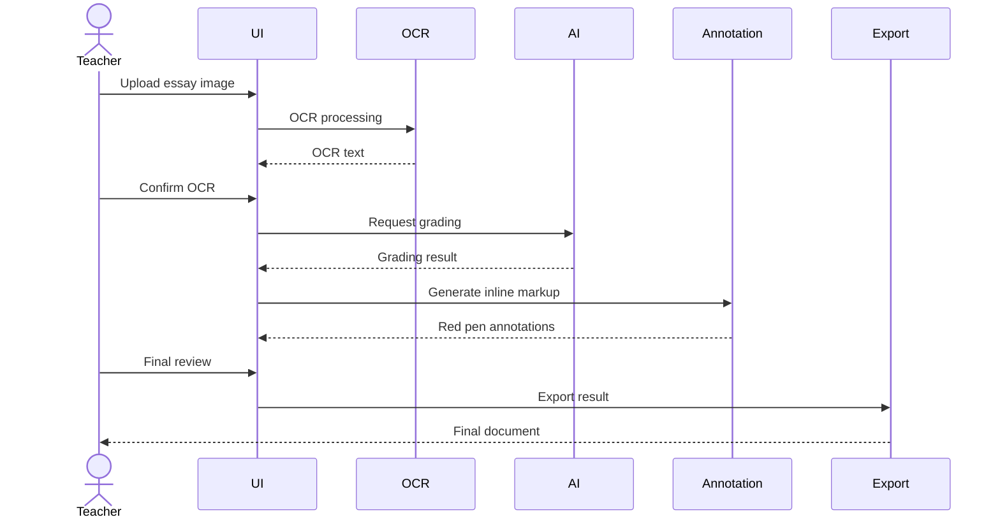

---

# 16. Sequence Diagram - Encryption Flow

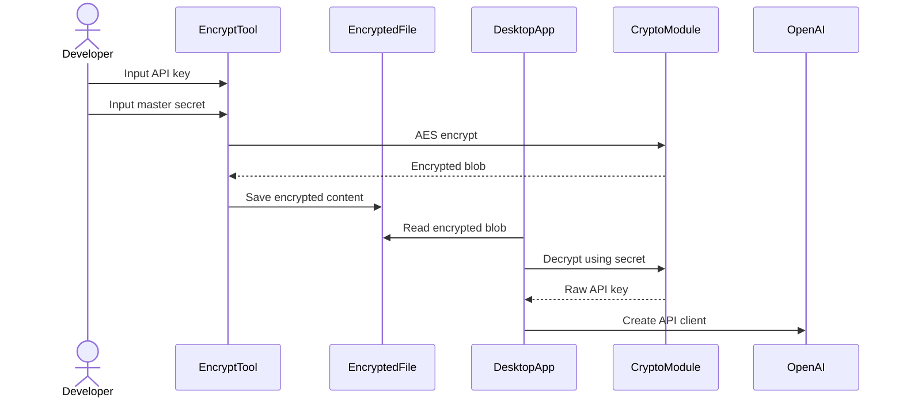

---

# 17. Sequence Diagram - App Startup

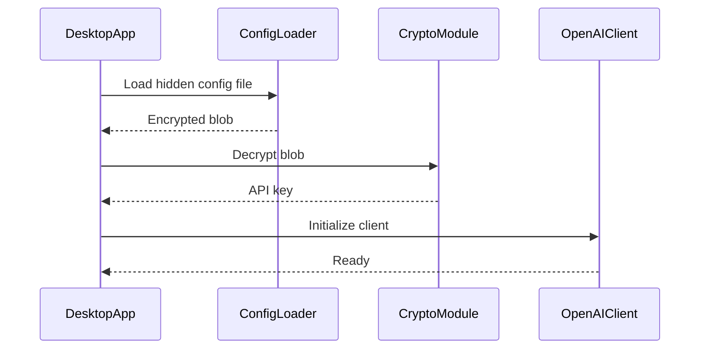

---

# 15. Recommended File Structure

```text
/app
  /src
  /services
  /security
    decrypt.ts
    crypto.ts

/tools
  encrypt-key.ts

/app-data
  .core
```
