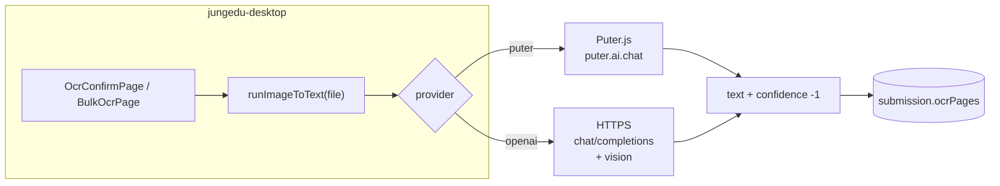

# Spec — Chuyển ảnh bài làm → văn bản (image-to-text)

## Mục tiêu

Từ file ảnh (bài làm viết tay), thu được **chuỗi văn bản tiếng Việt** đưa vào bước chỉnh sửa và chấm AI. Một abstraction không phụ thuộc một vendor cố định.

## Kiểu dữ liệu

```ts
type ImageToTextResult = {
  text: string
  /** Vision AI: -1. Dữ liệu submission cũ có thể còn điểm 0…1 từ pipeline đã gỡ. */
  confidence: number
  provider: 'puter' | 'openai'
}
```

## Cấu hình (Vite env)

| Biến | Ý nghĩa |
|------|---------|
| `VITE_IMAGE_TO_TEXT_PROVIDER` | `puter` \| `openai` (mặc định `puter`) |
| `VITE_PUTER_VISION_MODEL` | Model vision Puter (vd `gpt-4o-mini`) |
| `VITE_OPENAI_API_KEY` | Chỉ khi `provider=openai` |
| `VITE_OPENAI_API_BASE` | Mặc định `https://api.openai.com/v1` |
| `VITE_OPENAI_VISION_MODEL` | Model vision OpenAI |
| `VITE_PUTER_CLEANUP_MODEL` | Puter — bước lành OCR trước chấm (mặc định `gpt-4o-mini`) |
| `VITE_PUTER_GRADING_MODEL` | Puter — chấm rubric JSON (mặc định `gpt-4o-mini`) |

Prompt tiếng Việt (ảnh → chữ): `apps/desktop/src/services/imageToText/prompts.ts`.

## Kiến trúc (diagram)



## Chấm điểm AI (khác pipeline ảnh → text)

Sau khi chỉnh văn bản, **GradingPage** gọi `runAiGrade` → `grading/pipeline.ts`: hai lần Puter (`VITE_PUTER_CLEANUP_MODEL`, `VITE_PUTER_GRADING_MODEL`) trả JSON (lành OCR → rubric + nhận xét). Không có backend Express trong repo.

## Mở rộng provider

1. Thêm file trong `apps/desktop/src/services/imageToText/providers/`.
2. Trả về `ImageToTextResult`.
3. Thêm nhánh trong `runImageToText` và literal union trong `config.ts`.

## Tham chiếu

- Puter.js: [developer.puter.com — Puter AI](https://developer.puter.com/tutorials/free-unlimited-openai-api/)
- ADR: [convert-text.md](./convert-text.md)
